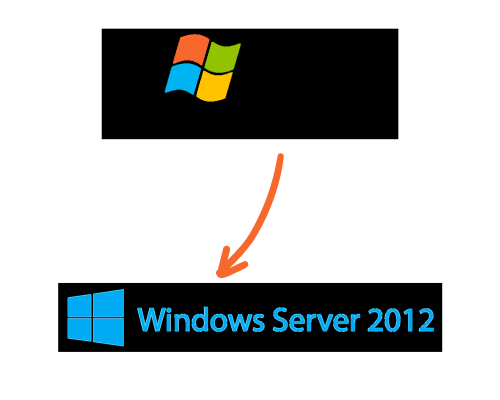

# Windows Server 2003 to 2012 Domain Migration
Transitioned an existing domain infrastructure from Windows Server 2003 to Windows Server 2012.

## Environments and Technologies Used

- Microsoft Hyper-V Server 2012

## Operating Systems Used

- Windows Server 2003
- Windows Server 2012

## High-Level Deployment and Configuration Steps

- Perform discovery by gathering data about the domain controller
- Confirm Windows Server 2003 roles and replication using Windows Support Tools
- Elevate existing Forest Functional Level to Windows Server 2003
- Install Windows Server 2012 Hyper-V as hypervisor for the virtual environment and created the VMs 
- Install and Windows Server 2012 and join to the existing domain
- Add roles to Windows Server 2012 
    - Active Directory Domain Services
    - DNS
    - DHCP
- Promote Server to domain controller, 
    - Add domain controller to an existing domain
    - Replicate data from the Windows Server 2003
- Transfer FSMO roles to Windows Server 2012 domain controller
- Remove Windows Server 2003 as Global Catalog Server
- Demote Windows Server 2003 using dcpromo
- Verify demotion in Active Directory Users and Computers

<h2>Architecture Diagram</h2>

